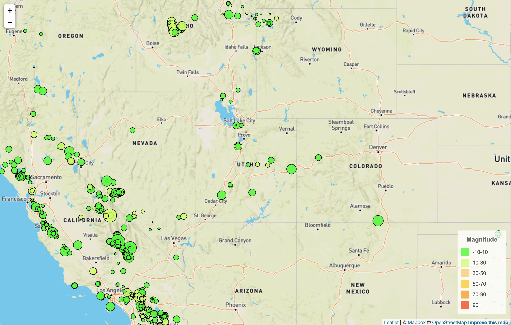
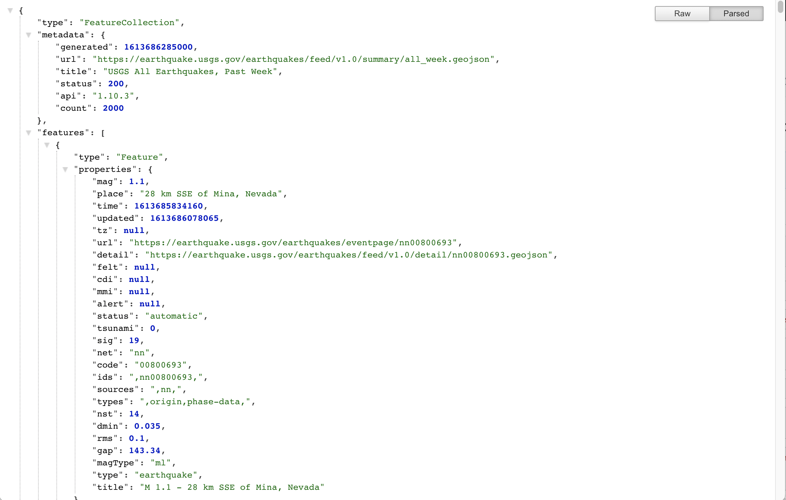

# Leaflet - Visualizing Earthquake Data

## Background

The USGS is responsible for providing scientific data about natural hazards, the health of our ecosystems and environment; and the impacts of climate and land-use change. Their scientists develop new methods and tools to supply timely, relevant, and useful information about the Earth and its processes. 

This project allows the USGS to visualize their earthquake data. They collect a massive amount of data from all over the world each day, but they lack a meaningful way of displaying it. Being able to visualize their data will allow them to better educate the public and other government organizations (and hopefully secure more funding..) on issues facing our planet.

## Task

Visualize an earthquake data set.

1. **Data set**

   

   The USGS provides earthquake data in a number of different formats, updated every 5 minutes. This project visualizes 'All Earthquakes from the Past 7 Days' from the [USGS GeoJSON Feed](http://earthquake.usgs.gov/earthquakes/feed/v1.0/geojson.php). The URL of this JSON is utilized to pull in the data for the visualization.

   

2. **Import & Visualize the Data**

   Create a map using Leaflet that plots all of the earthquakes from your data set based on their longitude and latitude.

   * Markers  reflect the magnitude of the earthquake by their size and and depth of the earth quake by color. Earthquakes with higher magnitudes appear larger and earthquakes with greater depth appear darker in color.

   * Includes popups that provide additional information about the earthquake when a marker is clicked.

   * The map legend provides context for map data.

- - -

### Technologies

* Leaflet

* Mapbox API

* JavaScript

* D3

* HTML

* CSS

